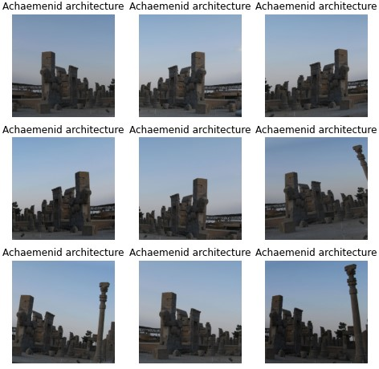
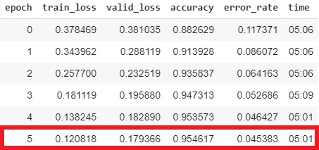
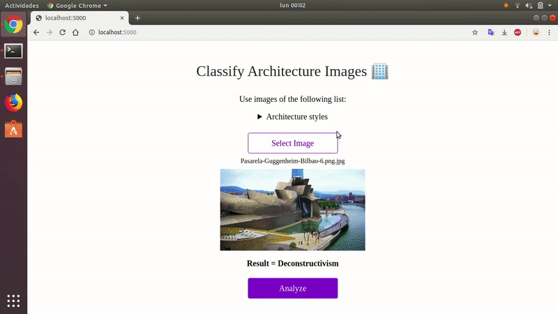
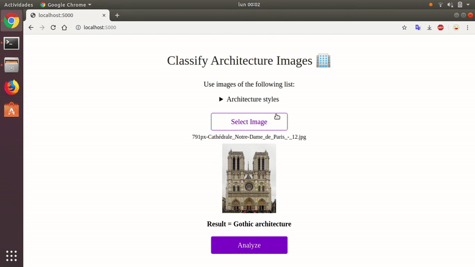

# ArchitecturalStyle Recognition

**ArchitecturalStyle Recognition** is a image classifier of 25 different architectural styles, using deep learning.

Made with [fastai](https://www.fast.ai) library.
Source code on [src](./src/architectural-style-recognition.ipynb). It can be runned in [Google Colab](colab.research.google.com)

## Table of content
* [Dataset](#dataset)
* [Training](#training)
* [Results](#results)
* [Demonstration](#demonstration)
* [Run the app locally](#run-the-app-locally)
* [License](#license)
* [Links](#links)

## Dataset

The dataset contains 10113 images from 25 architectural styles.
It is a mixed between images scraped from Google Images and the dataset from the paper "Architectural Style Classification using Multinomial Latent Logistic Regression" (ECCV2014), made by Zhe Xu.

<b>Number of images for each style</b>

- Achaemenid architecture: 392
- American craftsman style: 364
- American Foursquare architecture: 362
- Ancient Egyptian architecture: 406
- Art Deco architecture: 566
- Art Nouveau architecture: 615
- Baroque architecture: 456
- Bauhaus architecture: 315
- Beaux-Arts architecture: 424
- Byzantine architecture: 313
- Chicago school architecture: 278
- Colonial architecture: 480
- Deconstructivism: 335
- Edwardian architecture: 280
- Georgian architecture: 381
- Gothic architecture: 331
- Greek Revival architecture: 523
- International style: 417
- Novelty architecture: 382
- Palladian architecture: 343
- Postmodern architecture: 322
- Queen Anne architecture: 720
- Romanesque architecture: 301
- Russian Revival architecture: 352
- Tudor Revival architecture: 455

The original dataset was made by Zhe Xu.
According to the paper, the best accuracy they could get in 2014 was nearly 70% accuracy.
[Paper "Architectural Style Classification using Multinomial Latent Logistic Regression" (ECCV2014)](http://vigir.missouri.edu/~gdesouza/Research/Conference_CDs/ECCV_2014/papers/8689/86890600.pdf)

- [Extended dataset](https://www.kaggle.com/dumitrux/architectural-styles-dataset)
- [Original dataset](https://www.kaggle.com/wwymak/architecture-dataset)

#### Data augmentation

The extended dataset is used to test the model with "real world" images, in this case google images, whicha are not taken in perfect conditions.

To make the original dataset bigger and get better results, data augmentation is used.
Which is achived creating new images, by transforming (horizontal flip, zoom, light, rotate, etc.) the images.

In this case we go from 4979 to 9588 images.

## Training

#### Training vs Test sets

The dataset is splitted in two:
  * training set (80%)
  * test set (20%)

## Results
We got a **95%** of accuracy on this dataset

## Demonstration

<b>More examples</b>

**Greek Revival:**

**Byzantine:**

**Gothic:**

**Bauhaus:**

## Deployment

The [app](./app) folder contains the application ready to deploy on [Render](https://render.com).

### Run the app locally

The app can be runned locally.

First of all, you have to check all the [Requirements](./requirements.txt), then run this command in your terminal:

    python app/server.py serve

Or in python3:

    python3 app/server.py serve

*Note: it has been only tested in Linux.*

## License

MIT License

## Links

* [fastai](https://www.fast.ai)
* [Render](https://render.com)
* [Google Colab](colab.research.google.com)

## Author
Danci, Marian Dumitru ([@dumitrux](https://github.com/dumitrux))